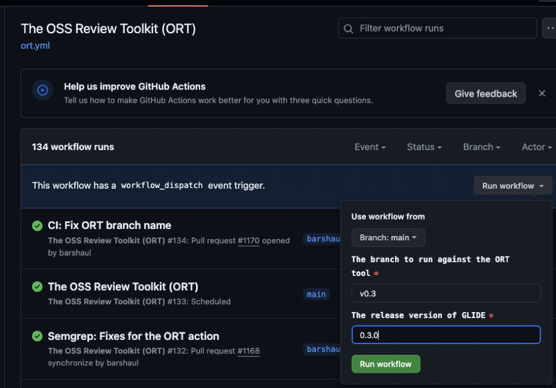
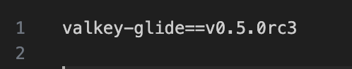
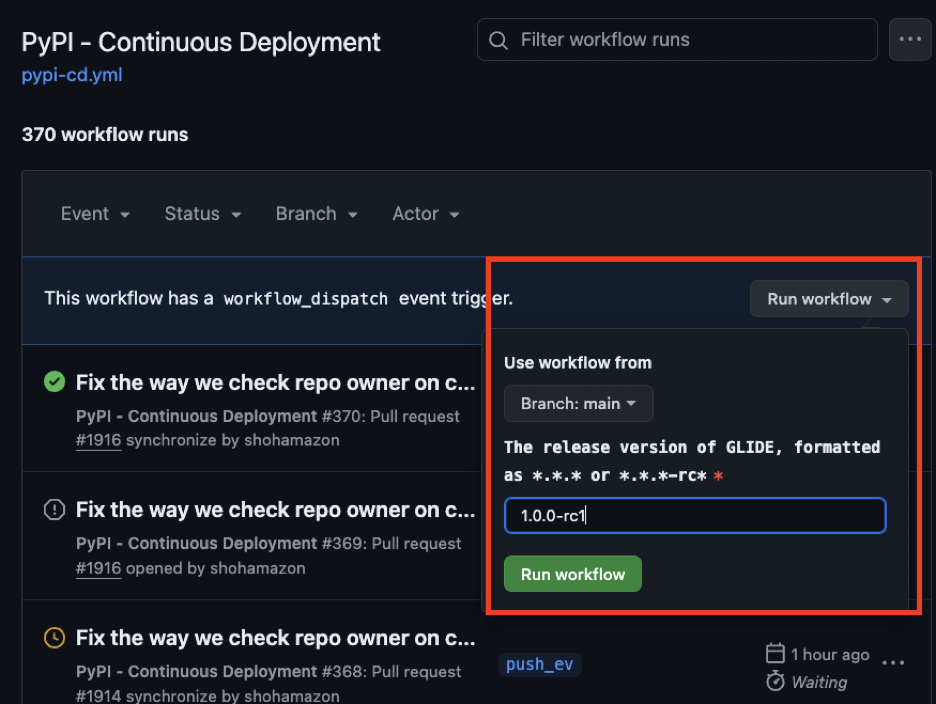
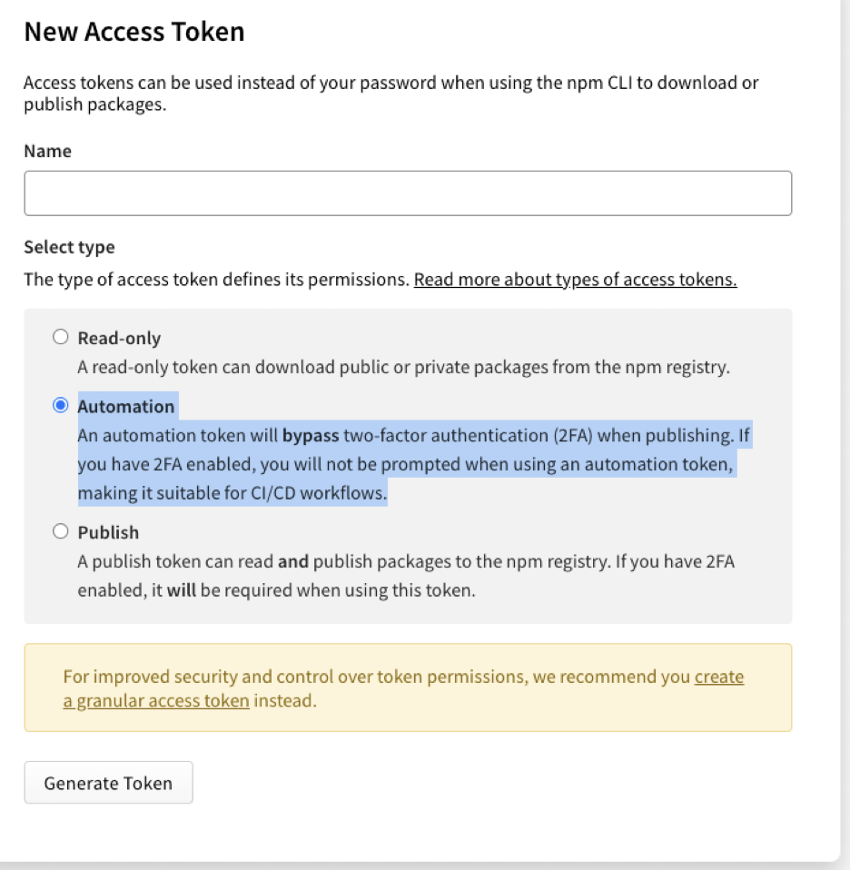

# Release Documentation

This document describes the process on how to release a new version of Valkey-GLIDE, how to use the GLIDE's CD workflows, and how to release a new wrapper.

## GLIDE - How to release a new version

**Contact a Valkey-GLIDE maintainer** on how to trigger the CD workflows and on how to login to the package manager accounts and how to access the relevant secrets.

## Deployment Guide

1. CHANGELOG: go through the CHANGELOG.md file found in the root folder and verify all required changes / bug fixes / features for this release are found in the file. Add a headline of the version and the release date to close all of its changes, for example for releasing version 0.3.0:

    ### 0.3.0 (2024-03-25)
    #### Changes
    * Python: Allow routing Cluster requests by address. ([#1021](https://github.com/aws/glide-for-redis/pull/1021))
    * Python, Node: Added HSETNX command. ([#954](https://github.com/aws/glide-for-redis/pull/954), [#1091](https://github.com/aws/glide-for-redis/pull/1091))

    #### Features
    * Python: Allow chaining function calls on transaction. ([#987](https://github.com/aws/glide-for-redis/pull/987))

    ### 0.2.0 (2024-02-11)
    #### Changes
    * Python, Node: Added ZCARD command ([#871](https://github.com/aws/glide-for-redis/pull/871), [#885](https://github.com/aws/glide-for-redis/pull/885))

    b. Open a PR to the main branch with the missing changes and the new version header, and continue after it’s merged.


2. **If it’s a new minor/major version**, create a new branch named in the format `v$MAJOR_VERSION.$MINOR_VERSION` (e.g., v0.2), and checkout only the relevant code for this release (probably the latest commit in main, including the CHANGELOG latest commit). <br>

    MAJOR_VERSION = 0 <br>
    MINOR_VERSION = 3 <br>
    git checkout -b `v$MAJOR_VERSION.$MINOR_VERSION` <br>

    a. Find how you saved the upstream remote repo (valkey-io/valkey-glide):
    ```
    [10:09:23] ubuntu (v1.x*)$ git remote -vv
    origin  https://github.com/your-repo/valkey-glide (fetch)
    origin  https://github.com/your-repo/valkey-glide (push)
    origin-aws      https://github.com/valkey-io/valkey-glide (fetch)
    origin-aws      https://github.com/valkey-io/valkey-glide (push)
   ```

   b. Push this branch to the upstream repo:
   git push origin-aws

    1. **If it’s only a patch version and the branch already exists**, checkout the existing branch (e.g. git checkout origin-aws/v0.2), and merge in the commit you’ve merge into main with the updates to the CHANGELOG.md file.
    2. **Attributions file (ORT)**: Make sure the attributions file is updated by manually running the ORT workflow:

        a. Go to: https://github.com/valkey-io/valkey-glide/actions/workflows/ort.yml <br>

        b. On the right corner, click on “Run workflow” and set the branch to run against the ORT tool to your newly created branch name (e.g. v0.3), and the exact release version (e.g. 0.3.0) <br>

        c. <br>
        

        d. If diff is found the workflow will open a PR in the release branch with the required changes. Make sure that all dependencies are approved by a Valkey-GLIDE maintainer, refer to the SOP - Check the Licenses: ORT/Attributions File Setup and Usage Instructions. Merge the PR once it is ready.

        1. Trigger the CD workflow

            a. The CD workflow will deploy the code into the package managers of the different wrappers. If there is any issue with the CD, **contact a Valkey-GLIDE maintainer**.

            b. To trigger a new release we need to tag the new branch commit with the release version, if its a release candidate, which should
                   be release before a real release in order to test the version, add
                   -rc$RC_VERSION:

            c. git tag v1.x.x-rc0

            d. Find how you saved the upstream remote repo (valkey-io/valkey-glide):

            e.

            ```
            [10:09:23] ubuntu (v1.x*)$ git remote -vv
            origin  https://github.com/your-repo/valkey-glide (fetch)
            origin  https://github.com/your-repo/valkey-glide (push)
            origin-aws      https://github.com/valkey-io/valkey-glide (fetch)
            origin-aws      https://github.com/valkey-io/valkey-glide (push)
            ```

            f. Push the tag to the upstream remote so it would trigger the CD action:

            g. git push origin-aws v1.x.x-rc0

            h. For each time your release fails all you need to do is create new tag in which the next rc version (e.g. v0.5.0-rc3 → v0.5.0-rc4).

            i. After the release candidate deployed, in node tests running automatically and when release candidate CD workflow is done successfully we can immediately release the real version. In python there’s no such support currently, so you'll first need to test the RC version you deployed on the different supported platform.You can do so by cloning the repo into each machine, go to [examples/python/requirements.txt](https://github.com/valkey-io/valkey-glide/blob/main/examples/python/requirements.txt).

            j. and change the version to the version you just released.

            

            k. From the root directory,
                run `cd examples/python`
            l. Then,
                run `pip install -r requirements.txt`
            m. Then,
                run `pip list` and validate that the right version has been installed.
            n. run `python3 ../../utils/cluster_manager.py -r 1 -n 3 --cluster-mode`
                and
                `python3 ../../utils/cluster_manager.py -r 1 -n 1`

            o. Edit the file [standalone_example.py](https://github.com/valkey-io/valkey-glide/blob/main/examples/python/standalone_example.py) or [cluster_example.py](https://github.com/valkey-io/valkey-glide/blob/main/examples/python/standalone_example.py) to have the right port in the different functions and run python3.
            p. Once the CD workflow and all test have passed, you can release a real version such as `git tag v1.3.0`.

            q. Find how you saved the upstream remote repo (valkey-io/valkey-glide):

            r.
            ```
            [10:09:23] ubuntu (v1.x*)$ git remote -vv
            origin  https://github.com/your-repo/valkey-glide (fetch)
            origin  https://github.com/your-repo/valkey-glide (push)
            origin-aws      https://github.com/valkey-io/valkey-glide (fetch)
            origin-aws      https://github.com/valkey-io/valkey-glide (push)
            ```
            s. Push the tag to the upstream remote so it will trigger the CD action:

            t. git push origin-aws v1.x.x


2. Update the release notes in github

    a. Go to: https://github.com/valkey-io/valkey-glide/releases

    b. Click on "Draft a new release"

    c. Add the release tag

    d. Copy + paste the release notes from the CHANGELOG.md file

## How to use GLIDE's CD workflows

For deployment guide, see the above section **`GLIDE - How to release a new version`**.

### **Secrets**

Please **contact a Valkey-GLIDE maintainer** to access the secrets for this repository.

### **How to trigger the CD workflow**

The CD workflow can be triggered in several ways.

1. **By pushing a Version Tag**: Trigger the CD workflow by pushing a version tag in the format "v*.*." or "v.*.*-rc".
For example, v1.0.0-rc1. When triggered by a push event with a version tag, all package manager CD workflows (e.g., pypi-cd.yml, npm-cd.yml, java-cd.yml) will be initiated.
The version will be extracted from the tag.

    a.
    ```
    [13:39:23] ubuntu $ git remote -vv
    origin  https://github.com/your-repo/valkey-glide (fetch)
    origin  https://github.com/your-repo/valkey-glide (push)
    origin-aws      https://github.com/valkey-io/valkey-glide (fetch)
    origin-aws      https://github.com/valkey-io/valkey-glide (push)
    ```


2. **By Workflow Dispatch:** Manually trigger the CD workflow using the "workflow dispatch" option.
This is done on a specific CD workflow by passing the required version as an input parameter in the format "*.*.*" or "*.*.*-rc*".
This method will not trigger deployments for other package managers and will not create a tag in the repository.

    a. <br>
    


3. **Pull Requests:** Pull requests will trigger the CD workflows as "dry runs" without actually publishing to the package managers.
This ensures that changes do not break the CD logic. Note that PRs affecting the CD workflows (e.g., introducing changes in the CD paths) can only be opened from branches on the
valkey-io/valkey-glide main repo (rather than from forks) since running the CD, even without publishing, requires access to the repository's secrets.


### **Self-hosted runner**

We use a self-hosted runner for Linux-arm64, as GitHub does not currently provide one.
We have an automated action to start the self-hosted runner, detailed here: [automatic action to start the self-hosted runner.](https://github.com/valkey-io/valkey-glide/pull/1128)

To manually start the self-hosted runner or to log into it for debugging purposes, **contact a Valkey-GLIDE maintainer**.

### **PyPi**

**Contact a Valkey-GLIDE maintainer** to have access to the AWS PyPI account-they will be able to log ing to the PyPI account along with generating API tokens if needed.

### **NPM**

**Contact a Valkey-GLIDE maintainer** to create a Valkey-GLIDE npm account.

1. Create an account.

    a. Once you have created your [NPM account](https://www.npmjs.com/signup). Ensure that you have 2FA enabled.
    Then use npm login in your shell to sign in with it. Do not share a team account. You should generally be using an account unique to you.

    b. If you need a bot user to perform build actions, **contact a Valkey-GLIDE maintainer**.

    c. When you're ready to make your first release (including checking that things are OK with npm pack), you can run npm publish.
    Your artifacts will be uploaded to the registry, and your package will be live. You can view it at https://npmjs.com/package/package-name-here.

    d. Once your package is created, you'll need to do some set-up online to ensure it's properly linked to company resources. Add the user "amzn-oss" to your package's owner list.
    This helps out with a couple of things:

    i. If your somehow lose access to your own account, we can help recover your package. <br>
    ii. If everyone loses access, the "amzn-oss" account is on record to prove ownership.

    e. We used to have instructions here to have you "register" your package with the aws/amzn/etc orgs.
    We no longer recommend this as it requires manual action with npm support for very little operational gain.

<br>
2. Create an access tokens

a. Access Tokens → Generate new token → classic token

b. Use a separate [granular access token](https://docs.npmjs.com/about-access-tokens#about-granular-access-tokens) for every actor on every project.
For example, if you have CD automation publishing to npm on two projects, you should have two separate granular tokens, each of which only has permissions on a single project.
This reduces impact when you rotate these tokens and reduces risk if there is ever a security issue with a token.

c. **Use an Automation token so it could be used in CD workflow:**:
An automation token will bypass two-factor authentication (2FA) when publishing.
If you have 2FA enabled, you will not be prompted when using an automation token, making it suitable for CI/CD workflows.



3. Change the NPM_AUTH_TOKEN secret in github with the new access token.

4. Change the NPM_SCOPE variable to an empty string.


5. **To test publishing in a private mode,** keep the current NPM access token and scope, it will be uploaded to private account-**contact a Valkey-GLIDE maintainer** about accessing the token.


### **Maven Central**

**Contact a Valkey-GLIDE maintainer** about using a self-hosted runner.


## **GLIDE - How to release a new wrapper**

TODO list:

1.  Create a README.md file following the python [README](python/README.md)

2.  Create a DEVELOPER.md file following the python [DEVELOPER.md](python/DEVELOPER.md)

3.  Create examples following the python [examples](https://github.com/valkey-io/valkey-glide/tree/main/examples/python)

4.  Update the main [README](README.md) file with link to the new wrapper readme under Getting Started

5.  Update the Current Status in the main README file

6.  Make sure all required structures/types/enums are exported

7.  Create a workflow to automate code deployment to the relevant package manager (see pypi_cd.yml for example)

8.  Add this wrapper to the ort.yml workflow so it would generate contributions file for this wrapper, make sure that the folder has updated THIRD_PARTY_LICENSES_<WRAPPER> file. **Contact a Valkey-GLIDE maintainer** for more details.

9.  Check that there is no vulnerabilities

10. Contact a Valkey-Glide maintainer for access to the GLIDE -  How to release a new version document to release the new version to the package managers.

11. Create a new brazil package for this wrapper
