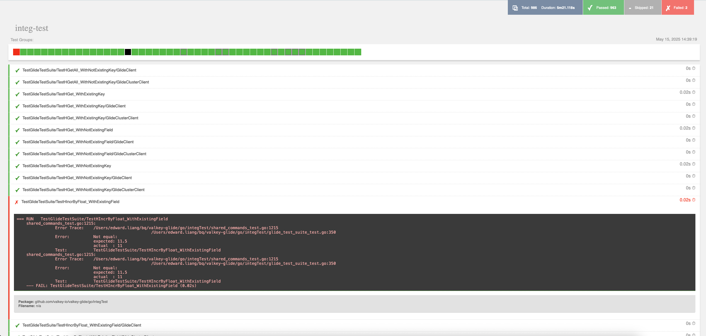

# Developer Guide

This document describes how to set up your development environment to build and test the Valkey GLIDE Go wrapper.

### Development Overview

The Valkey GLIDE Go wrapper consists of both Go and Rust code. The Go and Rust components communicate in two ways:

1. Using the [protobuf](https://github.com/protocolbuffers/protobuf) protocol.
2. Using shared C objects. [cgo](https://pkg.go.dev/cmd/cgo) is used to interact with the C objects from Go code.

### Build from source

#### Prerequisites

Software Dependencies

- Go
- GNU Make
- git
- GCC
- pkg-config
- cmake
- protoc (protobuf compiler) >= v3.20.0
- openssl
- openssl-dev
- rustup
- ziglang and zigbuild (for GNU Linux only)
- valkey (for testing)

**Valkey installation**

See the [Valkey installation guide](https://valkey.io/topics/installation/) to install the Valkey server and CLI.

**Dependencies installation for Ubuntu**

```bash
sudo apt update -y
sudo apt install -y git gcc pkg-config openssl libssl-dev unzip make cmake
# Install Go
sudo snap install go --classic
export PATH="$PATH:$HOME/go/bin"
# Install rust
curl --proto '=https' --tlsv1.2 -sSf https://sh.rustup.rs | sh
source "$HOME/.cargo/env"
# Check that the Rust compiler is installed
rustc --version
```

> [!NOTE]
> You may wish to add the entire `export PATH` line to your shell configuration file to persist this path addition, either `.bashrc` or `.zshrc` depending on which shell you are using.

Continue with **Install protobuf compiler** and **Install `ziglang` and `zigbuild`** below.

**Dependencies installation for CentOS**

```bash
sudo yum update -y
sudo yum install -y git gcc pkgconfig openssl openssl-devel unzip wget tar cmake
# Install Go
wget https://go.dev/dl/go1.22.0.linux-amd64.tar.gz
sudo tar -C /usr/local -xzf go1.22.0.linux-amd64.tar.gz
export PATH="$PATH:/usr/local/go/bin"
export PATH="$PATH:$HOME/go/bin"
# Install rust
curl --proto '=https' --tlsv1.2 -sSf https://sh.rustup.rs | sh
source "$HOME/.cargo/env"
# Check that the Rust compiler is installed
rustc --version
```

> [!NOTE]
> You may wish to add the entire `export PATH` line to your shell configuration file to persist this path addition, either `.bashrc` or `.zshrc` depending on which shell you are using.

Continue with **Install protobuf compiler** and **Install `ziglang` and `zigbuild`** below.

**Dependencies installation for MacOS**

```bash
brew update
brew install go make git gcc pkgconfig openssl cmake
export PATH="$PATH:$HOME/go/bin"
curl --proto '=https' --tlsv1.2 -sSf https://sh.rustup.rs | sh
source "$HOME/.cargo/env"
# Check that the Rust compiler is installed
rustc --version
```

> [!NOTE]
> You may wish to add the entire `export PATH` line to your shell configuration file to persist this path addition, either `.bashrc` or `.zshrc` depending on which shell you are using.

Continue with **Install protobuf compiler** below.
It is not necessary to **Install `ziglang` and `zigbuild`** for MacOS.

**Install protobuf compiler**

Various platform-specific zips can be found [here](https://github.com/protocolbuffers/protobuf/releases/v3.20.3).
Choose the appropriate zip for your system and run the commands below, adjusting for the zip you chose:

```bash
PB_REL="https://github.com/protocolbuffers/protobuf/releases"
curl -LO $PB_REL/download/v3.20.3/protoc-3.20.3-linux-x86_64.zip
unzip protoc-3.20.3-linux-x86_64.zip -d $HOME/.local
export PATH="$PATH:$HOME/.local/bin"
# Check that the protobuf compiler is installed. A minimum version of 3.20.0 is required.
protoc --version
```

> [!NOTE]
> You may wish to add the entire `export PATH` line to your shell configuration file to persist this path addition, either `.bashrc` or `.zshrc` depending on which shell you are using.

**Install `ziglang` and `zigbuild`**

```bash
pip3 install ziglang
cargo install --locked cargo-zigbuild
```

#### Building and installation steps

Before starting this step, make sure you've installed all software requirements.

1. Clone the repository:

    ```bash
    VERSION=2.0.0 # You can modify this to other released version or set it to "main" to get the unstable branch
    git clone --branch ${VERSION} https://github.com/valkey-io/valkey-glide.git
    cd valkey-glide
    ```

2. Install build dependencies:

    ```bash
    cd go
    make install-build-tools
    ```

3. Build the Go wrapper:

    ```bash
    make build
    ```

4. Install Go development tools with:

    ```bash
    make install-dev-tools
    ```

### Test

We run our tests using Go's `testing` package. For convenience, we bundled test configuration and logging into makefile commands to simplify the process.

#### Test Categories

The Valkey GLIDE Go wrapper has three main categories of tests:

1. **Unit Tests**: Tests that verify individual components in isolation
2. **Example Tests**: Runnable examples that serve as documentation and basic functionality tests
3. **Integration Tests**: Tests that verify the integration with Valkey/Redis servers
   - **Standard Integration Tests**: Tests basic functionality against Valkey/Redis servers
   - **Module Tests**: Tests specific Valkey/Redis modules functionality
   - **PubSub Tests**: Tests PubSub functionality
   - **Long Timeout Tests**: Runs tests with timeouts that may take longer than normal tests

To run unit tests, use:

```bash
make unit-test
```

To run all examples:

```bash
make example-test
```

To run standard integration tests (excluding module tests):

```bash
make integ-test
```

To run module-specific tests:

```bash
make modules-test
```

To run pubsub tests:

```bash
make pubsub-test
```

To run these tests:

```bash
make long-timeout-test
```

#### Running Specific Tests

For all of the above tests, we can specify individual tests, or tests matching a pattern, using the `test-filter=<regex>` parameter to specify a filter pattern to use.

```bash
# Run with a specific prefix (ex. run all tests that start with TestSet)
make integ-test test-filter=TestSet

# Run with a specifc pattern (ex. run all tests that start with TestSet or TestGet)
make integ-test test-filter="Test\(Set\|Get\)"
```

#### Additional Parameters

Integration and modules tests accept `standalone-endpoints`, `cluster-endpoints` and `tls` parameters to run tests on existing servers.
By default, those test suites start standalone and cluster servers without TLS and stop them at the end.

```bash
make integ-test standalone-endpoints=localhost:6379 cluster-endpoints=localhost:7000 tls=true
```

#### Test Reports and Results

Alongside terminal output, test reports are generated in `reports` folder.

An example of what the report looks like when an error occurs:



### Generate protobuf files

During the initial build, Go protobuf files were created in `go/internal/protobuf`. If modifications are made to the protobuf definition files (.proto files located in `glide-core/src/protobuf`), it becomes necessary to regenerate the Go protobuf files. To do so, run:

```bash
make generate-protobuf
```

### Linters

Development on the Go wrapper may involve changes in either the Go or Rust code. Each language has distinct linter tests that must be passed before committing changes.

#### Language-specific Linters

**Go:**

- go vet
- gofumpt
- staticcheck
- golines

#### Running the linters

Run from the main `/go` folder

```bash
make install-dev-tools

make lint
```

#### Fixing lint formatting errors

The following command can be used to fix Go formatting errors reported by gofumpt or golines. Note that golines does not always format comments well if they surpass the max line length (127 characters).

Run from the main `/go` folder

```bash
make format
```

### Benchmarks

To run the benchmarks, ensure you have followed the [build and installation steps](#building-and-installation-steps) (the tests do not have to be run). Then execute the following:

```bash
cd go/benchmarks
# To see a list of available options and their defaults:
go run . -help
# An example command setting various options:
go run . -resultsFile gobenchmarks.json -dataSize "100 1000" -concurrentTasks "10 100" -clients all -host localhost -port 6379 -clientCount "1 5" -tls
```

### Naming Conventions

#### Function names

For every command that you implement, please use PascalCase.

Examples of good command function names:

- `BZPopMin`
- `ZRem`
- `PExpireWithOptions`
- `SetWithOptions`
- `Decr`

Examples of bad command function names:

- `zRange`
- `hincrbyfloat`
- `Sdiffstore`

### Documentation

#### Adding links

When adding links, surround the piece of text using square brackets and then put the link reference at the bottom of the comment block.

When creating links to other types, surround `<Package>.<Type>` with square brackets.

For example, this links `valkey.io` and the `XPendingOptions` type with the proper reference:

```go
// Returns stream message summary information for pending messages matching a given range of IDs.
//
// See [valkey.io] for details.
//
// Parameters:
//
// key - The key of the stream.
// group - The consumer group name.
// opts - The options for the command. See [options.XPendingOptions] for details.
//
// Return value:
//
//  A slice of XPendingDetail structs, where each detail struct includes the following fields:
//
//  Id - The ID of the pending message.
//  ConsumerName - The name of the consumer that fetched the message and has still to acknowledge it.
//  IdleTime - The time in milliseconds since the last time the message was delivered to the consumer.
//  DeliveryCount - The number of times this message was delivered.
//
// [valkey.io]: https://valkey.io/commands/xpending/
```

#### Examples

In the Go client, we have runnable examples in the `*_test.go` files to supplement the documentation.

Use the following command to run all examples:

```bash
make example-test
```

Examples in Go are treated as tests by the framework. They must compile and execute without error and should return an `OK` response when run with the `make example-test` or `go test` commands.

#### Writing examples

To write an example for the command, find its respective group of commands and add the example to that `*_test.go` file. For example, `ZAdd` is a command that belongs to `sorted_set_commands` so we would add the example to `sorted_set_commands_test.go`.

According to which client you are working with, you can use `getExampleClient()` or `getExampleClusterClient()` for your examples.

Your example should look something like this:

```go
// string_commands_test.go:


// Template
func ExampleClient_Get() {
    var client *Client = getExampleClient() // example helper function

    // General set up and code execution

    fmt.Println(result)

    // Output: [expected result]
}
```

There can only be a single `Output:` directive in an example and it should be the last item in the example `func`. For examples with a single print statement, you should put the expected result on the same line as the `Output:` directive. For examples with multiple print statements, include the expected output from each print statments on separate comment lines after the `Output:` directive. For example:

```go
// Single-line example
func ExampleClient_Set() {
    var client *Client = getExampleClient() // example helper function

    result, err := client.Set("my_key", "my_value")
 if err != nil {
  fmt.Println("Glide example failed with an error: ", err)
 }
 fmt.Println(result)

 // Output: OK
}

// Multi-line example
func ExampleClient_Sort() {
 var client *Client = getExampleClient() // example helper function
 result, err := client.LPush("key1", []string{"1", "3", "2", "4"})
 result1, err := client.Sort("key1")
 if err != nil {
  fmt.Println("Glide example failed with an error: ", err)
 }
 fmt.Println(result)
 fmt.Println(result1)

 // Output:
 // 4
 // [{1 false} {2 false} {3 false} {4 false}]
}
```

For complex return types, it may be difficult to understand a response with multiple nested maps and arrays. Consider outputing the response as formatted JSON or use multiple print statements to break down and test key parts of the response. For example:

```go
func ExampleClient_XPending() {
 var client *Client = getExampleClient() // example helper function

    // Setup here...

 summary, err := client.XPending(key, group)
 if err != nil {
  fmt.Println("Glide example failed with an error: ", err)
 }
 jsonSummary, _ := json.Marshal(summary)
 fmt.Println(string(jsonSummary))

 // Output: {"NumOfMessages":1,"StartId":{},"EndId":{},"ConsumerMessages":[{"ConsumerName":"c12345","MessageCount":1}]}
}
```

#### Function names for examples

`pkgsite` is a program which generates documentation for Go projects.  To install and run it, execute the following:

```bash
# In the valkey-glide directory
cd go
go install golang.org/x/pkgsite/cmd/pkgsite@latest
pkgsite -open .
```

In order for `pkgsite` to work properly, examples for API must be written in a very specific format. They should be located in one of the `*_test.go` files in `go` directory and follow this pattern: `Example<ClientType>_<FunctionName>()`. If we wanted to create an example for the `Get` command in `Client`, we would name define our function as follows:

```go
func ExampleClient_Get() {
    // Example code here
}
```

In cases where we want to show more than one example, we can add extra endings to the function names. **Endings must begin with a lowercase letter:**

```go
// Bad: extension begins with upper case
func ExampleClient_Get_KeyExists() { ... }

// Bad: extension begins with number
func ExampleClient_Get_1() { ... }

// Good: extension begins with lower case letter
func ExampleClient_Get_one() { ... }

// Better: extension begins with lower case letter and is descriptive
func ExampleClient_Get_keyIsNil { ... }
```

**Note: `ClientType` and `FunctionName` are CASE-SENSITIVE.**

### Recommended extensions for VS Code

- [Go](https://marketplace.visualstudio.com/items?itemName=golang.Go)
- [rust-analyzer](https://marketplace.visualstudio.com/items?itemName=rust-lang.rust-analyzer)

## Community and Feedback

We encourage you to join our community to support, share feedback, and ask questions. You can approach us for anything on our Valkey Slack: [Join Valkey Slack](https://join.slack.com/t/valkey-oss-developer/shared_invite/zt-2nxs51chx-EB9hu9Qdch3GMfRcztTSkQ).
