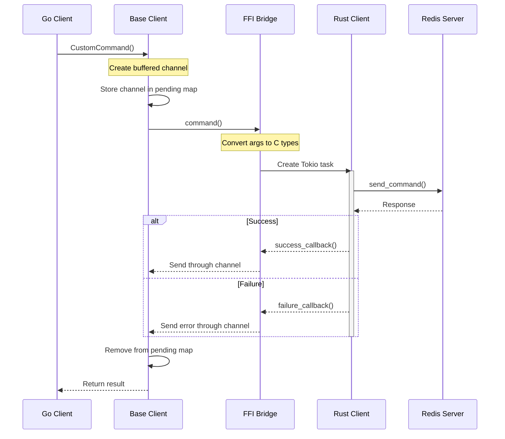

# Command Execution Flow in Base Client

This document outlines the flow of data and control when executing a command through the base client using `CustomCommand()` as an example.

## Overview

When executing a command like `result, err := client.CustomCommand([]string{"ping"})`, the flow spans both Go and Rust components of the application. Here's how it works:

## Step-by-Step Flow

1. **Go Side - Initial Call**
   - The flow begins in Go when `CustomCommand()` is called on a client instance
   - The command is routed through the base client's `executeCommand()` method
   - No goroutines are used directly at this level

2. **Channel Creation and Management**
   - A buffered channel is created to handle the command response: `resultChannel := make(chan payload, 1)`
   - The channel is pinned to prevent garbage collection while Rust holds a reference
   - The channel pointer is stored in the client's pending map for cleanup

3. **FFI Bridge to Rust**
   - The command is passed to Rust through CGO using the `command()` function
   - Command arguments and metadata are converted to C-compatible types
   - The channel pointer is passed to Rust to enable asynchronous response handling

4. **Rust Side - Command Processing**
   - Rust receives the command and creates a Tokio runtime task
   - The command is executed asynchronously using `client.send_command()`
   - Response callbacks are set up for both success and failure cases

5. **Response Handling**
   - Success or failure callbacks are invoked from Rust
   - These callbacks send the response back through the channel to Go
   - The channel is then removed from the pending map

## Concurrency Details

- **Go Side**: 
  - Uses channels for async communication but no explicit goroutines
  - Blocking occurs at channel receive after command submission
  - Thread safety managed through mutex in base client

- **Rust Side**:
  - Uses Tokio runtime for async execution
  - Single worker thread handling command execution
  - Callbacks push results back to Go through channels

## Memory Management

- Channel pointers are carefully managed between Go and Rust
- Rust response data is properly freed after transfer to Go
- Client resources are protected by reference counting (Arc in Rust)

## Error Handling

- Errors are propagated from Rust to Go through the failure callback
- The channel system ensures errors are properly delivered
- Memory cleanup occurs in both success and error cases

This architecture provides a clean bridge between Go and Rust while maintaining memory safety and proper concurrency handling without explicit goroutine usage.
